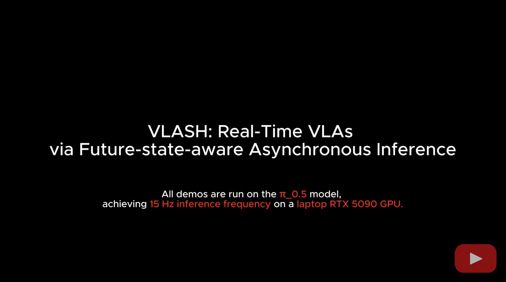

<!-- markdownlint-disable MD001 MD041 -->

<p align="center">
  <picture>
    
  </picture>
</p>
<h3 align="center">
Easy-to-use VLA deployment, fast to react, smooth in motion.
</h3>

<p align="center">
    <a href="https://arxiv.org/abs/2512.01031"><b>Paper</b></a>
</p>

---

## About

VLASH is an efficient and easy-to-use framework for VLAs fine-tuning and inference.

VLASH is efficient through:

- Asynchronous inference for **fast reaction and smooth motion** in real-time (**>30Hz inference frequency** for $\pi_{0.5}$ on RTX 5090)
- Future-state-awareness to enable **stable asynchronous VLA inference without overhead**
- Action quantization for **faster robot execution speed**
- LoRA with shared observation encoding for **efficient fine-tuning on consumer GPUs**

VLASH is easy to use with:

- **Seamless integration with [LeRobot](https://github.com/huggingface/lerobot)** datasets (v2.1, v3.0), models and robots
- Simple YAML-based configuration system
- Support for various policy architectures (e.g., $\pi_{0.5}$, $\pi_0$, ...)
- Easy deployment on real robot hardware

## Demo

[](https://www.youtube.com/watch?v=IgN7CNicJS8)

## Getting Started

```bash
conda create -n "vlash" python=3.10
conda activate vlash
conda install ffmpeg=7.1.1 -c conda-forge
pip install -e .
```

### Quick Examples

**Fine-tune a VLA policy for your task, enabling smooth async inference without overhead:**

```bash
vlash train examples/train/pi05/async.yaml
```

**Run async inference on a robot:**

```bash
vlash run examples/inference/async.yaml
```

**Run async inference with 2x speedup:**
```bash
vlash run examples/inference/async.yaml --action_quant_ratio=2
```

## TODO
- [x] LoRA fine-tuning for $\pi_{0.5}$, $\pi_0$ under 12G GPU memory
- [ ] QLoRA fine-tuning for $\pi_{0.5}$, $\pi_0$ under 8G GPU memory
- [x] Efficient fine-tuning with shared observation


## Acknowledgment

This project is built upon the following excellent open-source projects: [LeRobot](https://github.com/huggingface/lerobot), [PEFT](https://github.com/huggingface/peft).

## License

Apache 2.0
